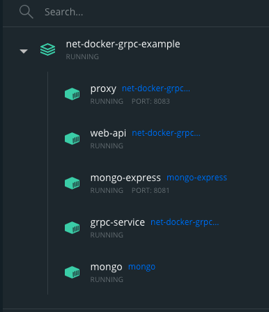
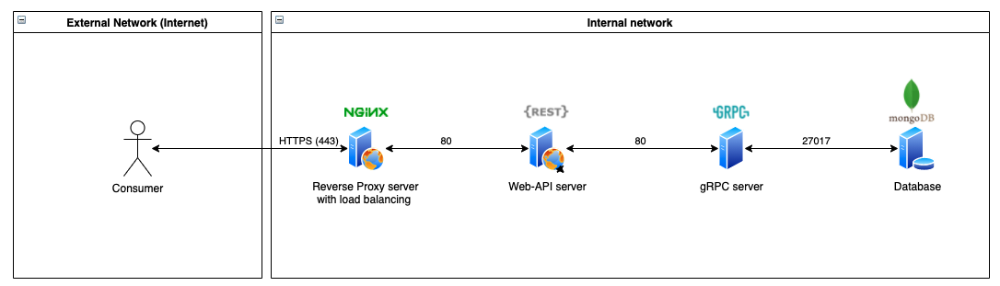

# net-docker-grpc-example

# What is that?

Set of example projects to show how to work with .NET/gRPC/docker together

# What are done?
- gRPC service (grpc-service) (actions: GetById,Create)
- WebApi Service
- Swagger UI(web-api)
- Mongo DB(mongo)
- Docker compose script that are build and run all containers
- Communication between WebApi and gRPC
- Internal network between containers

# Still in progress
- Connection strings inside .env
- Kubernetes
- Deployment

## List of containers

# How to Install ?

1. Connections:
Create .env file with the following env. variables:
`
MONGO_LOGIN=root
MONGO_PASSWORD=
MONGO_INITDB_DATABASE=MoviesDb

ME_CONFIG_MONGODB_SERVER=database
ME_BASIC_LOGIN=
ME_BASIC_PASS=

GRPC_ADDRESS=http://backend
`
2. `git clone https://github.com/T-REX-XP/net-docker-grpc-example && cd net-docker-grpc-example && docker compose build && docker compose up`

# Endpints
-	https://localhost:8083/swagger/index.html
-	https://localhost:8083/api/movies

# Suggestions and Notes:

## Network structure:
-	The following containers should be connected only via the internal network: **grpc-service, mongo, mongo-express,web-api,proxy**
-	The container with name **proxy** has exposed port to the host: **80/443** that should be used for consumers, the swagger UI will be available as well

## Reverse proxy
Theare is an additional service has been added: Proxy
It's Nginx web server that configured as reverse proxy with HTTPS certificates and potentialy can be used as a load balancer

## Container dependencies:
 - **mongo express** depends on mongo
 - **grpc-service** depends on mongo
 - **web-api** depends on grpc-service
 - **proxy** depends on web-api 

## Controllers:
- All actions of the controller should be async

